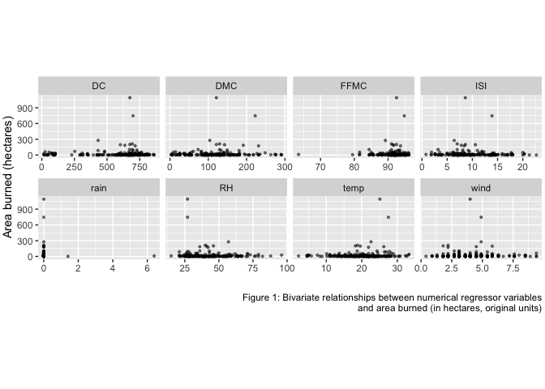
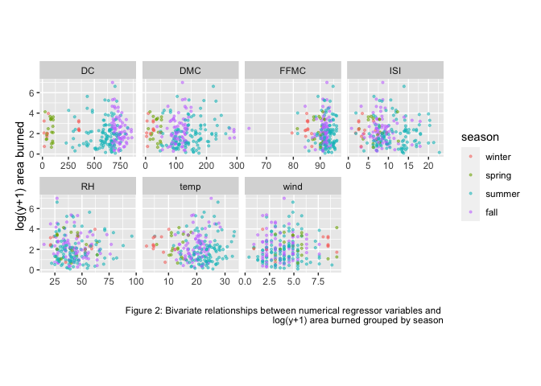
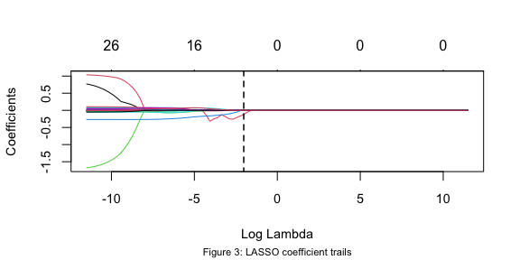
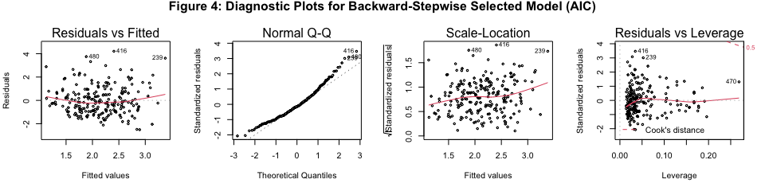
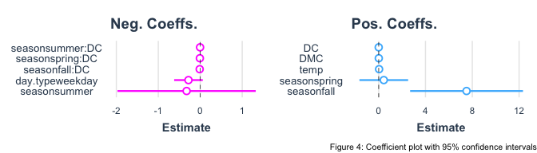
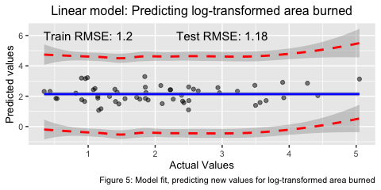
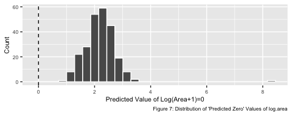

Montesinho Forest Fire
================

# 1 | Introduction

Wildfires (also called forest fires) are uncontrolled fires that occur
mainly in areas of forest preservation, although they can also spread to
residential and agricultural spaces, causing further damage. Many fires
are caused by a combination of environmental factors and intentional or
unintentional human activities, with vasts amount of forest land
destroyed by fires every year.

For purposes of successful firefighting, monitoring potential high-risk
areas can greatly contribute to early detection of anticipated fires.
**Our goal in this study is to therefore build a linear model that might
predict the area of land that will be burned or affected by a particular
wildfire.** If local governments monitor particular conditions, they can
more efficiently assess whether or not a region of interest might be
prone to wildfires. Predicting the destruction of anticipated fires will
accordingly be useful for alerting and preparing fire departments and
issuing emergency warnings.

# 2 | Data Description

This report will consider wildfire data from Montesinho Natural Park, a
high-prone area for wildfires located in northeastern Portugal. (From
1980 to 2005, over 2.7 million hectares of forest area in Montesinho was
destroyed by wildfires.) The
[dataset](https://archive.ics.uci.edu/ml/datasets/Forest+Fires?fbclid=IwAR3orFV-2u76MfAF1FbWfm-qtsCsP2OffZatnRAHgfaScgGRR2ET3vchWNQ)
was collected by Montesinho fire inspection authorities and
meteorological science researchers from the Polytechnic Institute of
Braganca. The dataset contains information about 517 observed Montesinho
fires from January 2000 to December 2003. For each fire recorded, the
dataset contains the following 13 variables, where `area` is treated as
our response
variable:

| Variable  | Description                                                                                                                                          |
| --------- | ---------------------------------------------------------------------------------------------------------------------------------------------------- |
| **X**     | an x-axis spatial coordinate signifying an eastern/western location within the Montesinho park map (1 to 9)                                          |
| **Y**     | a y-axis spatial coordinate signifying a northern/southern location within the Montesinho park map (2 to 9)                                          |
| **month** | month of the year the fire took place (“jan” to “dec”)                                                                                               |
| **day**   | day of the week the fire took place (“mon” to “sun”)                                                                                                 |
| **FFMC**  | Fine Fuel Moisture Code from the Fire Weather Index (FWI) system; moisture content of litter and other fine fuels at the ground’s surface            |
| **DMC**   | Duff Moisture Code from the FWI system; moisture content of loosely compacted or decomposed organic duff material that lies underneath forest litter |
| **DC**    | Drought Code from the FWI system; moisture content of deep, compact organic layers that lie beneath fine fuel and duff layers                        |
| **ISI**   | Initial Spread Index from the FWI system; expected rate of fire velocity spread                                                                      |
| **temp**  | average atmospheric temperature, in degrees Celsius                                                                                                  |
| **RH**    | relative humidity, in %                                                                                                                              |
| **wind**  | wind spped in kilometers per hour                                                                                                                    |
| **rain**  | outside rain content in millimeteres per square meter                                                                                                |
| **area**  | the area of land burned by the forest fire, in hectares (ha)                                                                                         |

# 3 | Data Preprocessing

Because `month` contains 12 possible values and `day` contains 7, the
inclusion of these two categorical variables would likely result in
overfitting with too many regressors, particularly if either or both of
them are involved in any interaction terms. As such, we transform the
`month` variable into `season` and `day` into `day.type`, as follows:
`month` is transformed into the four values winter (*dec*, *jan*,
*feb*), spring (*mar*, *apr*, *may*), summer (*jun*, *jul*, *aug*), and
fall (*sep, oct, nov*); day is transformed into the two values weekday
(*mon, tues, wed, thu*) and weekend (*fri, sat, sun*). We group Friday
with Saturday and Sunday as “weekend” day because more fires seem to be
recorded on Fridays, Saturdays, and Sundays compared to the other days
of the week; see Figure 8 in Appendix.

Additionally, the response variable `area` is heavily skewed towards
values of zero; in fact, 247 out of the dataset’s 517 total observations
have `area` equal to zero. In order to better align our data with the
requisite linear regression assumption of response variable normality,
some transformation or manipulation of `area` is needed. Because nearly
half of the dataset’s observations have `area` equal to zero, we do not
want to ignore these completely; we accordingly separate the
observations with `area` equal to zero into a dataframe called `fire.0`,
and those with `area` not equal to zero into a dataframe called
`fire.1`. Using `fire.1`, we will create a linear regression model to
predict the response variable `area`, given the knowledge that it is not
equal to zero; we will then evaluate this model to determine how well or
poorly it performs on the fires described in `fire.0`, which contains
fires that have `area` equal to zero.

We accordingly seek a transformation of `area` that will behave well
when applied to the observations in both `fire.1` and `fire.0`. A
log-transformation cannot be used because *log(0)* is undefined, and a
Box-Cox transformation inflates the transformed 0 `area` values by an
awkwardly large margin of separation from the nonzero Box-Cox
transformed `area` values (see Figure 9 in Appendix). As such, we
execute an ad-hoc *log(y + 1)* transformation of the `area` response
variable; this variable transformation was also executed by Cortez and
Morais (2007), who analyzed this same dataset (see References). For the
sake of brevity, this newly transformed variable will be called
`log.area`. Although an improvement from the original response variable
distribution, this variable transformation admittedly produces some
slight skewness, which may be consequential later in our analysis (see
Figure 10 in Appendix).

Finally, because our research question concerns *predicting* the
*log(y+1)*-transformed area burned by wildfires in Montesinho Natural
Park, given that the area burned is not zero, it would be of interest
for our model to be later tested on “unseen data,” or data that was not
used to construct the model. We therefore use the general rule-of-thumb
for an 80/20 dataset split, thereby reserving 216 observations for model
construction (i.e. the training set) and 54 observations that will be
used to assess the model’s performance in predicting the area burned by
future fires (i.e. the test set). The remaining 247 observations, for
which `log.area` equals zero, will be used later to evaluate how well
our model performs when predicting the `log.area` value of fires whose
true value is zero.

# 4 | Exploratory Data Analysis

Using bivariate scatter plots, we identify two high-end extreme outliers
for `area`, which are above 600 hectares. (Note this is `area` in its
original units, not the *log(y+1)* transformation of `area`; see Figure
1 below) However, because these data points could very likely represent
fires that were exceptionally destructive, we choose to leave them in
the dataset; the impact of these outliers will later be addressed when
discussing model diagnostics. These bivariate plots also illustrate that
the overwhelming majority of data points have `rain` equal to zero; as
such, going forward this variable will be excluded from our
analysis.

<!-- -->

Secondly, the variables `X` and `Y` represent spatial coordinates about
where wildfires have occurred within Montesinho Natural Park. We plot
these points in a spatial “scatter plot” in order to identify whether
some areas of the park have been more affected by large-scale wildfires
than other areas; however, this visualization illustrates fires of
varying degrees of severity are equally distributed throughout the park,
and no discernable areas have been disproportionately under or over
affected (see Figure 11 in Appendix). Similarly, a correlation plot
demonstrates that all of the explanatory variables are very weakly
correlated with `log.area`; meanwhile, a few pairs of explanatory
variables such as ISI/FFMC and DMC/DC have relatively high collinearity,
although later methods of model selection have some potential to trim
away collinear predictor variables that contribute little statistical
significance to candidate linear models. (See Figure 12 in Appendix.)

Finally, Figure 2 below plots `log.area` against all the available
numerical explanatory variables (excluding `rain`), with data points
color-coded according to the `season` variable. Intuitively, these
variables, being related to weather or nature, may change seasonally,
and so the purpose of these plots is to identify interaction terms. Upon
inspection, there seem to be interaction terms that exist between
`season` and each of the following variables: `temp`, `FFMC`, `DMC`,
`DC`, and `ISI`. These interaction terms will be considered subsequently
in processes of model
selection.

<!-- -->

# 5 | Model Selection

Based on exploratory data analysis, we decide to exclude the variables
`X`, `Y`, and `rain` when proceeding forward; interaction terms between
season and each of the remaining numerical predictor variables (`temp`,
`FFMC`, `DMC`, `DC`, and `ISI`) will also be considered in model
selection. Here, we define the *null model* to be a intercept-only model
that describes the response variable, `log.area`. We also define the
*full model* as follows, which includes all predictor variables still
under consideration, in addition to interaction
terms:

\(log.area ~ season + day.type + FFMC + DMC + DC + ISI + temp + RH + wind + season:FFMC + season:DMC + season:DC + season:ISI\)

The full model has a multiple R2 value of 0.1614 and an
adjusted R2 value of 0.04602. These low R2 values
coupled with the very high p-values for all of the full model’s
regressors clearly indicate that this is a very crude, rudimentary
initial model. (See Appendix for R output.)

It is very possible that a model containing a subset of these regressors
outperforms the full model in terms of prediction accuracy,
interpretability, and minimization of total error per the bias-variance
tradeoff, such that the best-performing model is neither too simple nor
too complex. To approximate the subset of regressors that contain the
strongest contributive impact to fitting values of `log.area`, we
leverage two methods of linear regression model selection: backward-step
variable selection via AIC and LASSO. We proceed to derive a candidate
model from each method and choose which one is better in terms k-folds
cross validation error.

# 5.1 | Backward-Step Variable Selection & AIC

According to *An Introduction to Statistical Learning with Applications
in R* (James et al.), backward-step variable selection requires that the
dataset’s sample size *n* be greater than the number of predictors *p*,
which is the case for our dataset and full model that contains all
possible regressors under consideration (209). Backward-step variable
selection begins with the full least-squares model containing all p
predictors and then iteratively eliminates the least significant
predictor, one at a time, until all remaining predictors have a p-value
smaller than the threshold determined by AIC (Akaike information
criterion).

The table below, derived from R, demonstrates that the model determined
by backward-step variable selection with AIC retains five main-effect
predictors (`season`, `day.type`, `temp`, `DMC`, and `DC`) along with a
single interaction term between season and DC. We find that this model
has an adjusted R2 of 0.0873, an improvement from the initial
full model’s adjusted R2 of 0.04602. We also find that the
AIC value for this model is 716.7668; AIC is a model-selection metric
that penalizes overly-complex models with too many regressors, and so
lower values of AIC are more preferable.

# 5.2 | LASSO

LASSO (Least Absolute Shrinkage and Selection Operator) is a regression
analysis method that solves for estimated coefficients by optimizing the
following:

\[\hat{\beta} = argmin_\beta ||y − X \beta||^2 + \lambda \sum_{i=1}^ n|\beta_j|\]

The LASSO method is advantageous because it uses L1-regularization to
penalize large coefficient estimates and because it favors sparse
models, forcing some of the coefficient estimates to be exactly zero at
the optimal value of the tuning hyperparameter \(\lambda\), which
minimizes the generated model’s cross validation error. As such, LASSO
performs variable selection by setting insignificant regression
coefficients equal to zero, in order to enhance the prediction accuracy
and interpretability of the model it produces. Here, the full
least-squares model will be run through LASSO in order to identify a
higher-performing subset of regressors.

Figure 3 below is a visualization of the LASSO coefficient trails, where
the vertical dashed line represents the optimal \(\lambda\)
hyperparameter. As the LASSO tightens, many coefficients converge to
zero; in fact, only 3 out of 27 regressors are nonzero at the optimal
\(\lambda\), a much fewer number of selected regressors compared to the
model chosen by backward-step selection and
AIC.

<!-- -->

# 5.3 | Model Selection Results

According to An *Introduction to Statistical Learning with Applications
in R* (James et al.), \(k = 5\) or \(k = 10\) is often used for k-folds
cross validation, as these values in practice have been generally shown
to yield test error rates that do not significantly suffer from
excessive bias nor high prediction error variance (184). Performing a
10-fold cross validation on our backward-step selection AIC model, we
calculate the cross validation RMSE of this model to be approximately
1.26, a lower value than the cross validation RMSE of the LASSO model,
which is approximately 1.30. Furthermore, the variables selected by
LASSO have some issues in terms of interpretability; for example, the
`summer` value of `season` was selected as a nonzero coefficient
estimate, but the estimated coefficients of the other possible values
for `season` were set to zero. Even if we include all regressor values
for season, the AIC of this LASSO-obtained model is 728.1805, which is
greater than the AIC of the model selected via backward-step selection;
recall that this value is 716.7668. As such, we choose the backward-step
selection AIC model as our final model, proceeding to further
analysis.

# 6 | Model Diagnostics

<!-- -->

Refering to Figure 4 above, the *Residuals vs. Fitted* plot reveals that
the residuals have a roughly constant variance, although the residual
mean appears to be above zero because the plot illustrates a consistent
tendency to underpredict `log.area`. The *Normal Q-Q plot* reveals that
the upper end of the model quantiles form a tail, although the majority
of the points appear to sufficiently satisfy the linear regression
assumption of response variable normality. The *Scale-Location* plot
shows whether or not the residuals are equally distributed along the
range of fitted values, demonstrating relative homoscedasticity in the
distribution of data points. Finally, the *Residuals vs. Leverage* plot
detects influential observations; although none of these points have a
Cook’s distance greater than 0.5, R identifies 3 points that have
greater influence relative to the others: observations \#239, \#416, and
\#470. \#239 and \#416 correspond to the two highest outliers of `area`
that were discussed earlier during *Section 3: Exploratory Data
Analysis*, reinforcing our suspicion that these two outliers represent
rare occurrences of highly destructive wildfires.

Despite that the model diagnostic plots in Figure 4 appear to be well
behaved in relation to assumptions of linear regression, recall that the
adjusted R2 value of our final model is 0.0873. To reconcile
this low adjusted R2 value with the appearance of the model
diagnostic plots, one possible explanation is that there exists a large
amount of white noise in the response variable, which would cause the
model’s predictor variables to have a weak ability in explaining the
variability of `log.area`.

# 7 | Model Interpretation

Our final model, obtained from backward-step selection of AIC, contains
10 predictors (excluding the intercept term), which includes interaction
terms between `DC` and `season`. This model has a very low adjusted
R2 value of 0.0873, a 10-folds cross validation RMSE of
approximately 1.26, and an AIC value of 716.7668.

In terms of interpretation, it is difficult to draw definitive
applications of prediction or causal inference from this model because
its predictors entirely involve aspects of weather and time (such as
`temp` and `season`), and thus they cannot necessarily be manipulated or
intervened. Because wildfires are a type of natural disaster, a variable
such as area of land burned is subject to large amounts of randomness
and variability in terms of both occurrence and severity. The dataset
used in this analysis is also specific to Portugal, which likely will
not be appropriate to generalize if studying wildfires in other regions
of the
world.

<!-- -->

Interpreting the estimated coefficients of the model also has its
difficulties. Based on Figure 5 shown above, many of the estimated
coefficients have values very close to 0, while the estimated
coefficients for `seasonsummer` and `seasonfall` have very wide 95%
confidence intervals, calculated based on the coefficients’ estimated
standard errors; the width of these confidence intervals correspond to
the length of the line segments in Figure 5. Other regressors such as
`day.typeweekday`, `seasonspring`, and `seasonsummer` have estimated
coefficients with 95% confidence intervals that span both negative and
positive values, which makes interpretation even more nebulous; for
example, does a fire’s occurrence in the spring months correspond to an
average increase or decrease in `log.area`, holding all other predictor
variables constant? It’s difficult to say, especially because the 95%
confidence interval for the estimated `seasonspring` coefficient is
centered at approximately 0. Accordingly, our model’s estimated
coefficients are either unstable, unreliable, or a combination of both,
an insight that is underscored by many of these coefficients having high
p-values that indicate questionable statistical significance.

# 8 | Prediction

Recall from *Section 3: Data Preprocessing* that we reserved 54
observations from the test set in order to evaluate our final model’s
performance in predicting `log.area` for new wildfires, given the
knowledge that the true value of `log.area` is not equal to zero; also
recall that the test set is 20% of observations in the dataset such that
`log.area` does not equal zero, while the remaining 80% functioned as
the model’s training set. Here, we construct prediction intervals at the
95% confidence level to simulate the forecast of `log.area` for future
wildfires, using the aforementioned 54 observations which function as
our test set. Figure 6 below illustrates the relative fit of our model
in predicting `log.area` for the test set observations (colored in blue)
and compares the RMSE for the training set and the test set. The red
dashed lines represent the average smoothed trend of the lower and upper
bounds for the 95% prediction
intervals.

<!-- -->

After using our final model to simulate forecast predictions of
`log.area` in the test set, we plot the fitted values against the actual
values, as shown in Figure 6 above. Although the training set RMSE and
test set RMSE are approximately equal to each other (1.20 and 1.18,
respectively), this result is undermined by the very wide average range
of the 95% prediction intervals, which illustrate that our model has low
precision (i.e. high forecast error) when making predictions about
`log.area` of new wildfires. RMSE values of 1.20 and 1.18 for the
training and test set, respectively, also underscore the low precision
of our model; because the response variable `log.area` is measured on a
logarithmic scale, RMSE values of 1.20 and 1.18 are actually quite large
relative to the response variable’s magnitude of scale.

# 9 | Model Limitations: Predicting Fires with `log.area=0`

Although the main purpose and motivation of our model is to predict the
specific *severity* of a wildfire for which it is known that it will
result in an area of land burned that is greater than 0 hectares, we now
propose a follow-up question, briefly mentioned previously in *Section
3: Data Preprocessing*: how well does our final model perform on
observations of fires that have `log.area` equal to zero? Recall that
`log.area` actually reflects a *log(y+1)* transformation of `area`,
originally in hectares; hence fires with `log.area` equal to 0 are
equivalent to fires with area equal to zero. Accordingly, we revisit the
dataframe `fire.0`, which contains data about 247 such wildfires; we
treat this dataframe as a unique type of second “test set” in order to
evaluate how our model predicts values of `log.area` for wildfires whose
true value of `log.area` equals zero. We acknowledge that the original
training set used to construct the model has fundamentally different
characteristics from the observations in `fire.0`, and hence we do not
necessarily expect these predictions to be accurate. In fact, the RMSE
of `fire.0` as a “second test set” is approximately 2.29, almost double
the value of the RMSE described in *Section 8: Prediction*, which is
1.18.

Furthermore, if our model would truly be a good fit for the fires
described in the `fire.0`, then we would expect the distribution of
these “predicted zeros” (or, more generally, response variable
predictions for fires whose true `log.area` is zero) to be roughly
centered about zero, with some noise permitting. However, the
distribution of these “predicted zeros” is centered at 2.5 and roughly
symmetric, as illustrated by Figure 7 below. This histogram
distribution, coupled with the high RMSE of 2.29, indicates that our
model is not well-suited for extrapolation to wildfires that would
result in no area of land burned in their
aftermath.

<!-- -->

# 10 | Discussion

Because the original dataset was heavily skewed towards values of 0 for
`area`, we modified this response variable using an ad-hoc *log(y+1)*
transformation. To make our analysis and final results more
interpretable, we now transform our actual and fitted values back to the
original response variable units (hectares of area burned) for our two
test sets: one containing fires such that `area` is known to be nonzero
and another containing fires such that area is known to be zero, which
we will respectively refer to as “Test Set 1” and “Test Set 2” for
brevity. For Test Set 1, we find that on average our model overpredicts
the response variable area more so than it underestimates, with an RMSE
of 25.68; in fact, about 56% of these fitted values were overestimates.
In the context of our analysis and research goal, overestimation of
`area` is arguably preferred over underestimation because the purpose of
our model is intended to provide insight on preventative measures that
local governments, fire departments, and agencies can take in order to
better prepare for wildfires and any destruction they may bring. Even if
our estimated predictions of damage are larger than the actual amount of
damage that would occur, adapting a conservative outlook that errs on
the side of caution is more prudent when the damage cost of wildfires is
so high. Namely, a research study about the economic impacts of
wildfires reported that from a 2003 series of wildfires in San Diego
County, California, a total of 3,760 hectares of land were destroyed and
cost approximately $2.45 billion in damages, averaging to $650,000 per
hectare of land burned (Diaz). Although the total sum of burned area
that our model predicts for Test Set 1 (479.42 hectares) is smaller than
the actual sum of burned area (811.05 hectares), we acknowledge that
building a model to precisely capture the predicted fire damage is
difficult due to the uncontrollable and inconstant nature of our
variables.

From our previous analysis of prediction using Test Set 2, we found that
based on RMSE our model performed significantly worse on fires whose
value of `log.area` was known to be zero, compared to fires whose value
of `log.area` was known to be nonzero. When we convert these values back
to their original units in hectares, this conclusion stil holds true,
only know it is reinforced by the magnitude of the RMSE values. One
reason why the RMSE of Test Set 2 measured in original units (259.23)
and the total predicted sum of burned area versus the total actual sum
of burned area (6265.91 hectares versus 0 hectares, respectively) have
such high values are twofold: the training set used to build the model
consisted only of fires whose true value of `area` was nonzero, and
linear regression is most likely the best choice for modelling fires
with `area` equal to zero. Suggestions regarding future directions of
analysis and potential next steps are discussed subsequently in *Section
11: Conclusion*.

# 11 | Conclusion

The goal for this analysis was to create a linear model that would
predict the total area of land burned by wildfires in Montesinho Natural
Park, based on a set of explanatory variables describing weather-related
conditons and the month/day that the fire took place. Our final model
was obtained via backward-step selection of AIC and had an adjusted
R2 of 0.0873, a 10-folds cross validation RMSE of
approximately 1.26, and an AIC value of 716.7668. The analysis
demonstrated some major shortcomings in terms of precision when
predicting the response variable log.area, both for fires known to have
a true `log.area` equal to zero and for fires known to have a true
`log.area` not equal to zero.

For further analysis, in order to classify wildfires that result in
damage versus no damage in terms of the area of land burned, a logistic
aggression might be appropriate; separating the entire original dataset
into fires with `area` equal to zero and `area` not equal to zero would
dichotomize `area` into a binary response variable. A logistic
regression model could then be constructed in order to predict the
*probability* between 0 and 1 that a particular fire would cause damage
in terms of area of land burned. The misclassification rate could also
be calculated based on a test set in order to assess the model’s
predictive performance. Logistic regression modelling does not require
many of the assumptions and requirements needed for linear regression
modelling, so this type of analysis could be more useful to draw
informative, accurate conclusions.

# 12 | References

  - Cortez, P. and A. Morais. A Data Mining Approach to Predict Forest
    Fires using Meteorological Data. In J. Neves, M. F. Santos and J.
    Machado Eds., New Trends in Artificial Intelligence, Proceedings of
    the 13th EPIA 2007 - Portuguese Conference on Artificial
    Intelligence, December, Guimarães, Portugal, pp. 512-523, 2007.
    APPIA, ISBN-13
    978-989-95618-0-9.http://www3.dsi.uminho.pt/pcortez/fires.pdf.

  - Diaz, John M. Economic impacts of wildfire. SFE Fact Sheet 2012-7.
    Joint Fire Science Program, Southern Fire Exchange.
    <https://fireadaptednetwork.org/wp-content/uploads/2014/03/economic_>
    costs\_of\_wildfires.pdf.

  - James, Gareth, et al. An Introduction to Statistical Learning with
    Applications in R. Springer, 2017.
